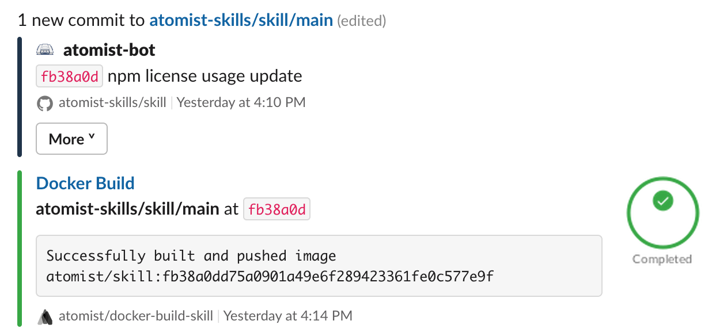
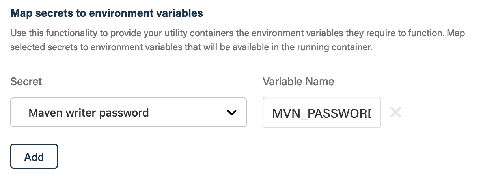
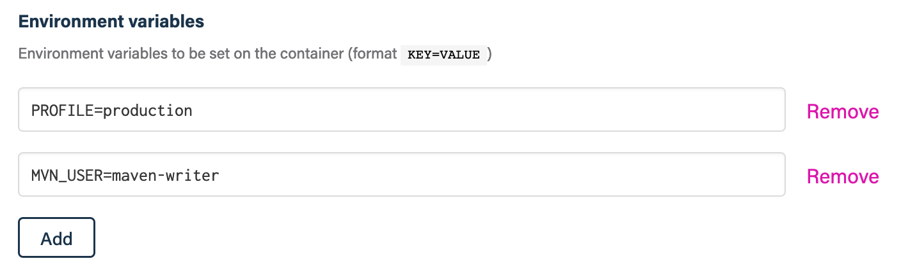
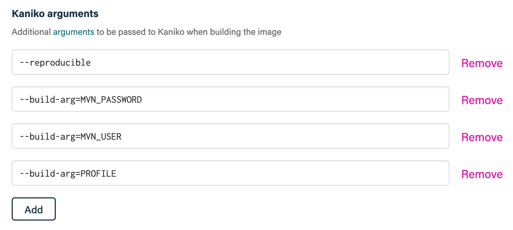
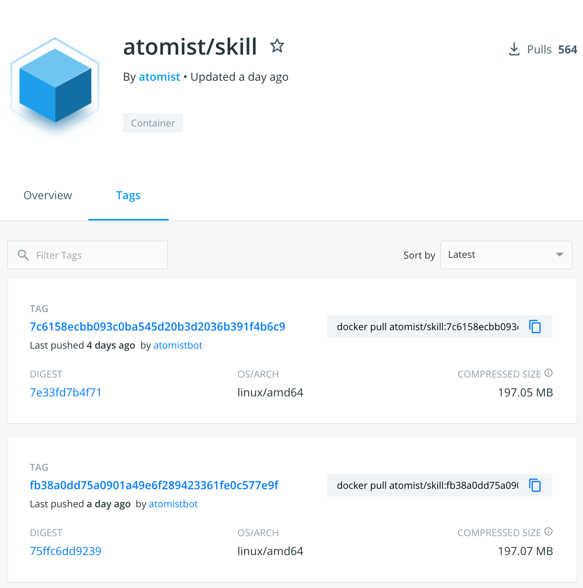
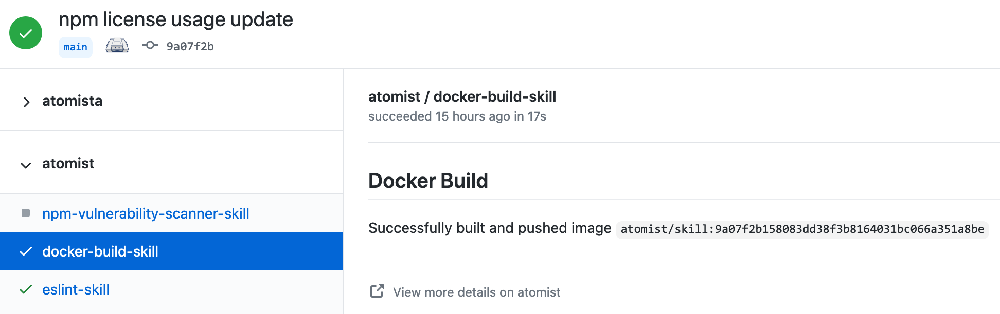
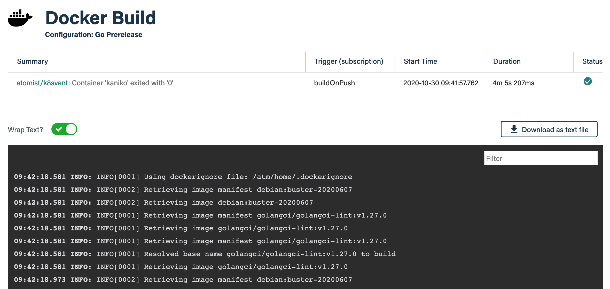

Creating consistent, reliable Docker builds across all your repositories can be
a pain. This skill greatly simplifies that process by standardizing your Docker
build configuration across all your repositories. No more hacky build scripts
copied from repository to repository, no more enabling builds one at a time, no
more setting up a Docker daemon and environment variables, just consistent,
reliable Docker builds every time. All you have to worry about if your
Dockerfile.

This skill uses
[kaniko](https://github.com/GoogleContainerTools/kaniko#readme "kaniko - Build Images In Kubernetes")
to build container images from your Dockerfiles and push them to your Docker
registry. Container image builds can be triggered by pushes of commits and/or
tags to a GitHub repository. The code associated with the commit or tag is
checked out and the container image is built using the Dockerfile. Once the
build is complete, the container image is pushed to your configured Docker
registry.

-   Reliable, consistent builds on every push
-   Pull and push container images from multiple Docker registries
-   Automatic image naming and tag creation
-   Easily customize the Docker build to your needs
-   GitHub commit check indicates success of failure of build

### Build Docker images on every push



### Use environment variables and secrets

If your container needs access to secret values, e.g., authentication tokens or
passwords, or environment variables, you can provide them in your Docker Build
skill configuration.

For secret values, you can create a secret to store the value and then map that
secret to an environment variable in the configuration.



There is another configuration section for environment variables.



Both the secret and normal environment variables are set in the container
performing the build. However, by default container environment variables are
not passed to the Docker build context. To make the environment variable
available within the Docker build context you must do two more things:

1.  Declare the environment variable as an
    [`ARG`](https://docs.docker.com/engine/reference/builder/#arg) in the
    Dockerfile

    ```dockerfile
    ARG MVN_PASSWORD
    ARG MVN_USER
    ARG PROFILE
    ```

1.  Provide the environment variable as a build argument to kaniko using its
    [`--build-arg`](https://github.com/GoogleContainerTools/kaniko#--build-arg)
    command-line option

    ```console
    --build-arg=MVN_PASSWORD
    --build-arg=MVN_USER
    --build-arg=PROFILE
    ```

    

Be aware that build arguments are visible to any user of a image. Therefore
avoid using build arguments with secret values in single-stage Docker builds or
the final stage of a multi-stage Docker build.

> You _cannot_ use the same environment variable name as both a secret and
> regular environment variable.

### Push Docker images to Docker Hub



### GitHub commit check



### Build status and logs


