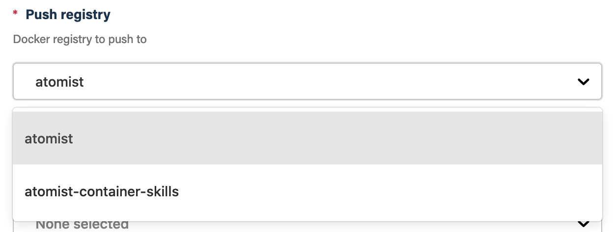
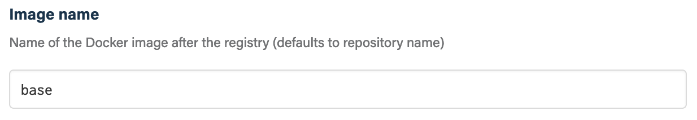
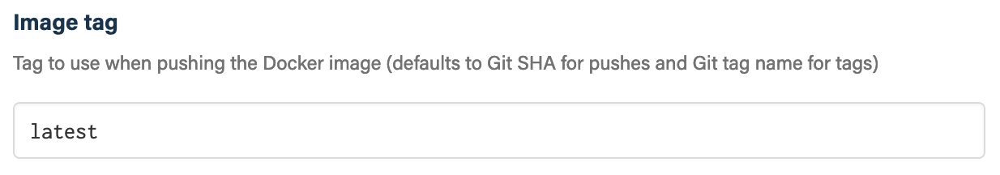
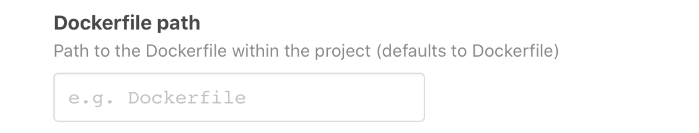
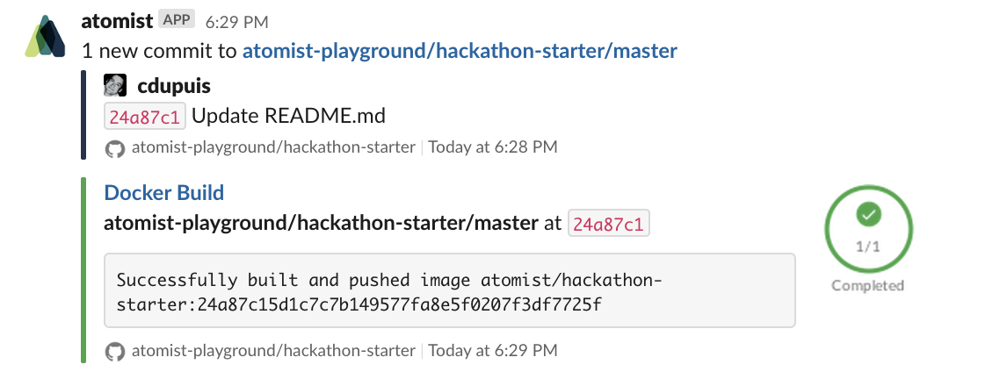

# `atomist/docker-build-skill`

<!---atomist-skill-description:start--->

Automatically build and push Docker images

<!---atomist-skill-description:end--->

---

<!---atomist-skill-long_description:start--->

Automatically build and push Docker images on pushes to Git 
repositories.

This skill takes the hard and cumbersome task setting up a working
`docker build` process away. Simply add this skill to your workspace
and configure a Docker registry to push and you are ready to build
your images.

<!---atomist-skill-long_description:end--->

---

<!---atomist-skill-readme:start--->

# What it's useful for

With this skill you can automatically build Docker images and push them to a Docker registry. The Docker build is triggered by a push to a Git repository.

This skill addresses the cumbersome task of setting up a working `docker build` process. Simply add this skill
to your workspace and configure a Docker registry to push to and you are ready to build your images. Super simple!

# Before you get started

Connect and configure these integrations:

1. **GitHub**
2. **Docker Registry**
3. **Slack**

The **GitHub** integration must be configured in order to use this skill. At least one repository must be selected.
The **Docker Registry** integration must also be configured in order to use this skill. At least one registry must 
be configured to push your images to. We recommend connecting the **Slack** integration.

    Note: Docker Hub is the first supported Docker registry. Support for Google Container Registry and 
    JFrog Artifactory is coming soon.

# How to configure

1. **Select a Docker registry to push to**

    
    
    First connect at least one Docker registry from **Manage -> Integrations**. Once connected you can then 
    select a registry to push to.
         
    
2. **Select Docker registries to pull from**

    
    
    Occasionally you may want to pull private base images from a different registry. Use the **Docker registries to pull 
    from** parameter to configure those additional registries.

3. **Specify the name of the image**

    
    
    Provide the name of the Docker image to create. If not provided this defaults to the name of repository.

4. **Specify the tag to create**
    
    
    
    Specify the Docker image tag to create. If not provided this defaults to Git SHA of the commit that was pushed.

5. **Specify the path to the Dockerfile**

    
    
    Path to the Dockerfile to use for building the image. This defaults to `./Dockerfile`. 
    
    The path is relative to the root of the repository.

6. **Determine repository scope**
   
   
   
   By default, this skill will be enabled for all repositories in all organizations you have connected.
   
   To restrict the organizations or specific repositories on which the skill will run, you can explicitly choose 
   organization(s) and repositories. 

# How to use Docker Build

1. **Configure the skill, providing at least a Docker registry to push to** 

2. **For every new Git push, a new Docker image will be built**
    
    When the optional **Slack** integration is configured, you'll see a progress message in the Slack
    channel that is linked to the repository.
    
    

3. **Enjoy not having to manually set up a Docker build and push pipeline!**

To create feature requests or bug reports, create an [issue in the repository for this skill](https://github.com/atomist-skills/docker-build-skill/issues). 
See the [code](https://github.com/atomist-skills/docker-build-skill) for the skill.

<!---atomist-skill-readme:end--->

---
 
Created by [Atomist][atomist].
Need Help?  [Join our Slack workspace][slack].

[atomist]: https://atomist.com/ (Atomist - How Teams Deliver Software)
[slack]: https://join.atomist.com/ (Atomist Community Slack)

