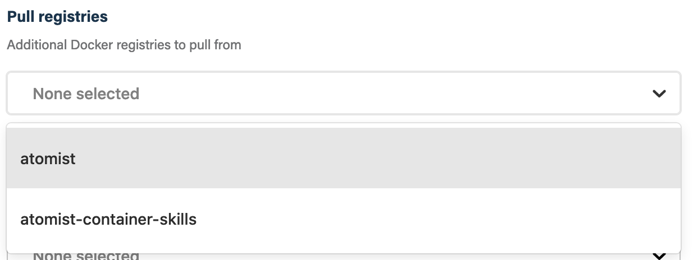
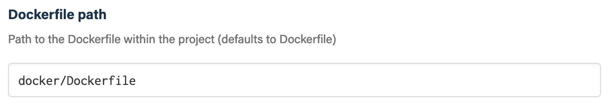

## Before you get started

Connect and configure these integrations:

1.  [**GitHub**](https://go.atomist.com/catalog/integration/github "GitHub Integration")
    _(required)_
1.  [**Docker Hub Registry**](https://go.atomist.com/catalog/integration/docker-hub "Docker Hub Registry")
    or
    [**Google Container Registry**](https://go.atomist.com/catalog/integration/google-container-registry "Google Container Registry (GCR)")
    _(required)_
1.  [**Slack**](https://go.atomist.com/catalog/integration/slack "Slack Integration")
    or
    [**Microsoft Teams**](https://go.atomist.com/catalog/integration/microsoft-teams "Microsoft Teams Integration")
    _(optional)_

## How to configure

1.  **Select a Docker registry to push to**

    

    First connect at least one Docker registry from **Manage -> Integrations**.
    Once connected you can then select a registry to push to.

1.  **Select Docker registries to pull from**

    

    Occasionally you may want to pull private base images from a different
    registry. Use the **Docker registries to pull from** parameter to configure
    those additional registries.

1.  **Select the trigger for running this skill**

    

    This skill can build Docker images on Git push or tag events. Use this
    parameter to configure the trigger.

1.  **Specify the name of the image**

    

    Provide the name of the Docker image to create. If not provided this
    defaults to the name of repository.

1.  **Specify the tag to create**

    

    Specify the Docker image tag to create. If not provided the default depends
    on how the build was triggered. If the build was triggered on a push, the
    default tag is the git SHA of the commit at the head of the push. If the
    build was triggered by a tag, the default tag is the name of the Git tag.

1.  **Specify the path to the Dockerfile**

    

    Path to the Dockerfile to use for building the image. This defaults to
    `./Dockerfile`.

    The path is relative to the root of the repository.

1.  **Create GitHub commit check**

    

    If selected, a GitHub check will be added to the commit indicating whether
    the build succeeded for failed.

1.  **Extra kaniko arguments**

    

    If your Docker build requires special arguments to
    [kaniko](https://github.com/GoogleContainerTools/kaniko/blob/master/README.md#additional-flags "kaniko command-line arguments"),
    you can provide them here.

    You can also use this argument to create additional image tags. For example,
    to add the "latest" tag to all images created by builds triggered by a tag,
    you can add this kaniko argument:

        --destination=${data.Tag[0].commit.repo.owner}/${data.Tag[0].commit.repo.name}:latest

    Similarly, to add the "next" tag to all images created by builds triggered
    by a push of commits, you can add this kaniko argument:

        --destination=${data.Push[0].repo.owner}/${data.Push[0].repo.name}:next

    In both of the above examples, we use data from the event that triggered the
    Docker build to provide the image repository and name.

1.  **Determine repository scope**

    

    By default, this skill will be enabled for all repositories in all
    organizations you have connected.

    To restrict the organizations or specific repositories on which the skill
    will run, you can explicitly choose organizations and repositories.

1.  **Activate the skill**

    Save your configuration and activate the skill by clicking the "Enable
    skill" button.
